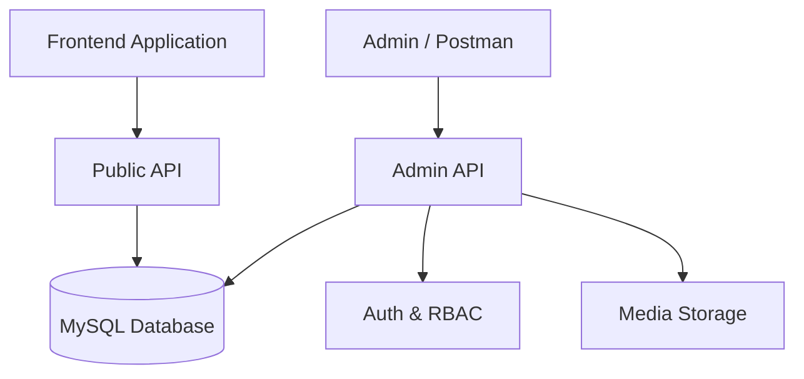

# Meem-Market: Enterprise Headless CMS Engine

[](https://laravel.com)
[](https://php.net)
[](https://opensource.org/licenses/MIT)

## 🏛️ Project Architecture
Meem-Market is a hybrid high-performance backend serving two primary functions:
1. **Public Storefront API**: A lightweight, read-heavy API serving the public-facing website.
2. **Headless CMS Admin**: A deep replication of industry-standard CMS administrative logic, built as a pure RESTful service with Laravel 12.



---

## 🛠️ Technical Specification

| Component | Implementation | Rationale |
| :--- | :--- | :--- |
| **Framework** | Laravel 12.x + PHP 8.2 | Modern syntax, promoted properties, and unmatched DX. |
| **Authentication** | Laravel Sanctum | State-of-the-box token management for headless clients. |
| **Authorization** | Capability-Based RBAC | Replicates standard CMS capabilities (e.g., `edit_posts`, `manage_options`). |
| **Database** | CMS-Compatible Schema | Facilitates future migration and uses established logic patterns. |
| **Documentation** | L5-Swagger (OpenAPI 3.0) | Auto-generated, interactive documentation via PHP Attributes. |
| **Architecture** | Service-Layer Pattern | Decouples business logic (Options, Roles, Media) from Controllers. |

---

## ✨ Core CMS Features

### 1. Robust Content Engine
*   **Post & Page CRUD**: Advanced content management with support for custom statuses (`publish`, `draft`, `trash`, `future`).
*   **Revision System**: Automatic snapshots on every update, allowing for granular content restoration.
*   **Smart Slugs**: Automatic, collision-resistant slug generation.
*   **Meta System**: Extensible Metadata for all core entities (Posts, Users, Comments, Terms).

### 2. Taxonomy & Relationships
*   **Hierarchical Taxonomies**: Native support for Categories and nested Term structures.
*   **Flat Taxonomies**: Optimized Tag management with automatic count recalculations.
*   **Object Relationships**: Advanced `term_relationships` for many-to-many content linking.

### 3. Integrated Security & RBAC
*   **Role Mapping**: Default roles (Admin, Editor, Author, etc.) with precise capability mapping.
*   **Middleware Protection**: `CheckCapability` middleware for granular endpoint security.

---

## 📂 Project Structure

```text
app/
├── Http/Controllers/Api/V1/
│   ├── Admin/              # CMS Core Logic (Replicated Admin Logic)
│   └── Public/             # Storefront Logic (Branches, Careers, etc.)
├── Http/Middleware/        # CheckCapability.php (Capability-based Auth)
├── Http/Resources/V1/Admin # Standardized JSON transformers
├── Models/                 # Hybrid Schema (CMS Tables + Custom Models)
├── Services/               # Domain-driven logic (OptionService, RoleService)
└── Providers/              # ContentTypeServiceProvider (Dynamic routing)
```

---

## 🚀 Getting Started

### Prerequisites
*   **PHP 8.2+** (with `intl`, `bcmath`, `curl` extensions)
*   **MySQL 8.0+**
*   **Composer**

### Installation
1.  **Clone & Install**:
    ```bash
    git clone [repository-url]
    composer install
    ```
2.  **Environment Configuration**:
    Configure your `.env` with DB credentials and application keys.
    ```bash
    cp .env.example .env
    php artisan key:generate
    ```
3.  **Database Provisioning**:
    ```bash
    php artisan migrate --seed
    ```
    *This initializes the `Administrator` user and the core `options` system.*

---

## 📡 API Usage & Documentation
The API is fully documented via **Swagger**. To view the interactive documentation:

1.  Start the development server: `php artisan serve`
2.  Navigate to: `http://localhost:8000/api/documentation`

### Common Endpoints
*   `POST /v1/admin/auth/login` - Authenticate and receive token.
*   `GET /v1/admin/posts` - List all posts.
*   `GET /v1/admin/pages` - List all pages.

---

## 📜 Development Standards
This project follows strict clean-code standards to ensure maintainability:
*   **SOLID Principles**: Each class has a single responsibility.
*   **Strict Typing**: Full use of PHP 8.2 type hinting.
*   **Service Layer**: Business logic remains outside of controllers.
*   **Fail Fast**: Immediate error reporting for invalid states.

---

## 📜 License
Meem-Market is released under the [MIT License](https://opensource.org/licenses/MIT).
